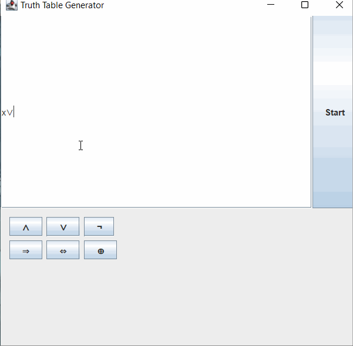

# Truth-Table-Generator
This is a truth table generator. It works with the logic portion of discrete mathematics. You input variables, symbols, and parenthesis and in return it outputs a complete truth table showing all the steps along the way. 

The table excpects valid input, any letters can be used as variables, but lowercase and uppercase are the same (a = A : a != B)

If parenthesis are off or a operand is in a invalid loction it will not work

## How it works
You input your truth table function into the space alloted, using the buttons provided to insert operations (and,or,xor,if,if and only if, negation). Then you
click start and you boolean function is displayed.

## Demonstration

